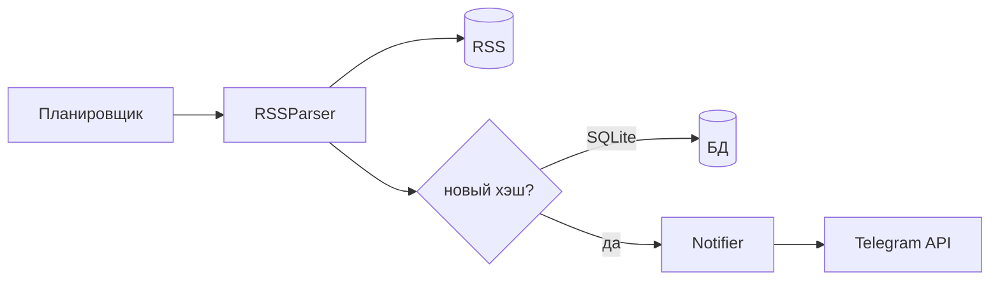

# RSS → Telegram

Планировщик опрашивает RSS, новые посты (по хэшу) сохраняются в SQLite и отправляются в Telegram. Секреты — только в `.env`.

## Запуск

```bash
python -m venv .venv
.venv\Scripts\activate
pip install -r requirements.txt
copy .env.example .env
```

Заполните `.env` (минимум `RSS_FEED_URL`; для Telegram — токен, `chat id`, `NOTIFICATION_DRY_RUN=false`).

```bash
python main.py --once    # один проход
python main.py           # по интервалу POLL_INTERVAL_SECONDS
```

**`chat not found`:** бот должен быть в чате. Напишите в чате любое сообщение, затем откройте в браузере  
`https://api.telegram.org/bot<ВАШ_ТОКЕН>/getUpdates` и найдите `"chat":{"id": ...}` — это `TELEGRAM_CHAT_ID`.

---

## Схема (задание п.1)



Планировщик запускает тик: парсер качает ленту, для каждой записи **Storage** проверяет `content_hash` в БД; если записи нет — **Notifier** шлёт сообщение и пост сохраняется.

---

## Модель поста (задание п.2)

`rss_notifier/models.py` — Pydantic `Post`: `title`, `link`, `published_at`, `content_hash`.

---

## Дедупликация (задание п.3)

SHA-256 от строки `guid | title | link | summary` (если нет guid — используется `link`). В SQLite первичный ключ — `content_hash`. Перед отправкой: `SELECT` по хэшу; после успешной отправки — `INSERT OR IGNORE`. После перезапуска дубликаты не уходят, пока база на диске.

---

## Кеш / хранение (сдача)

Память процесса обнуляется при рестарте, поэтому «видели ли пост» хранится в **SQLite** (один файл, без отдельного сервера). **Хэш** вместо одного только `link` снижает коллизии, когда у записей общий URL или меняется заголовок при том же материале.

---

## Классы (задание п.4)

| Класс | Файл |
|-------|------|
| `RSSParser` | `rss_notifier/parser.py` |
| `Storage` | `rss_notifier/storage.py` |
| `Notifier` | `rss_notifier/notifier.py` |
